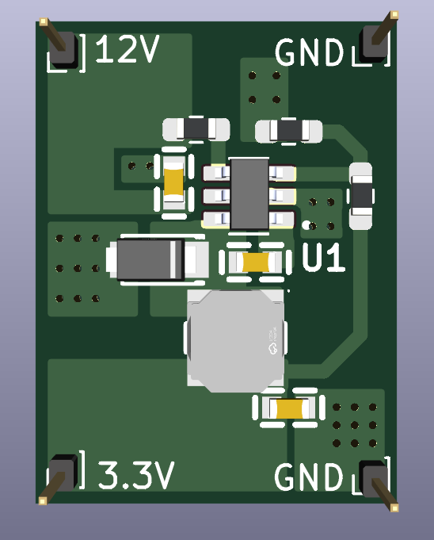
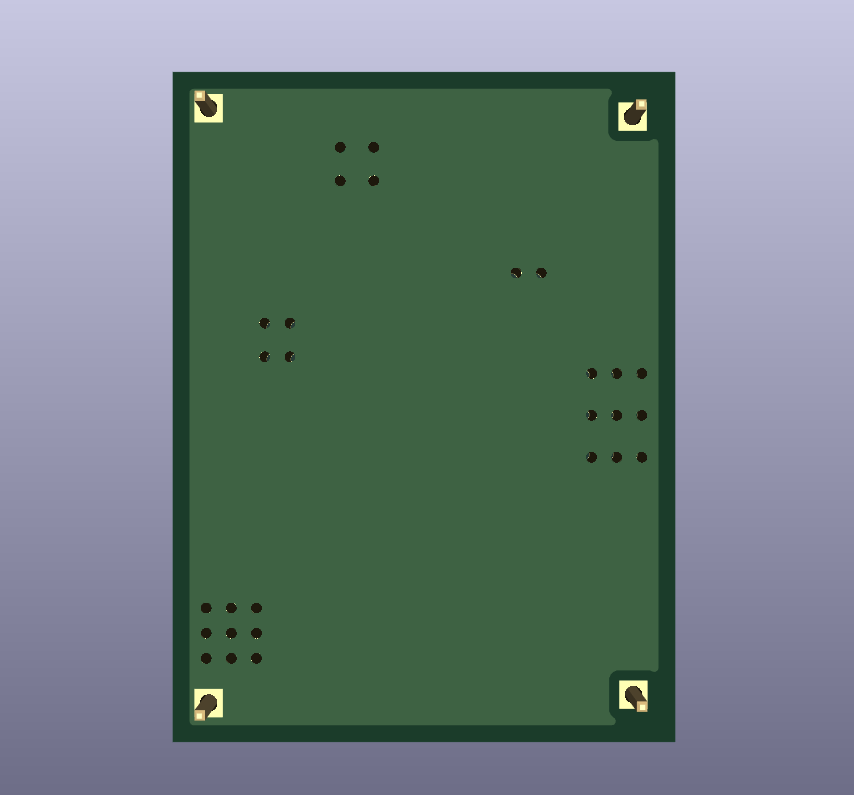
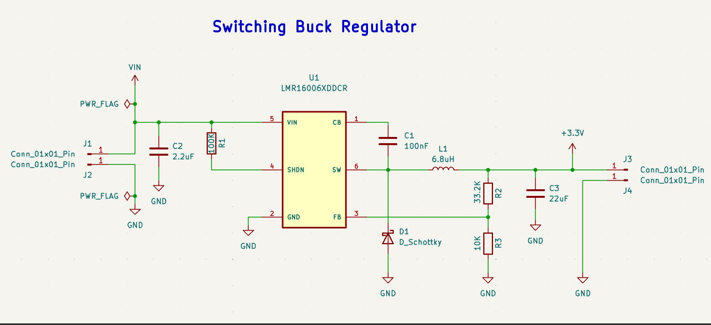
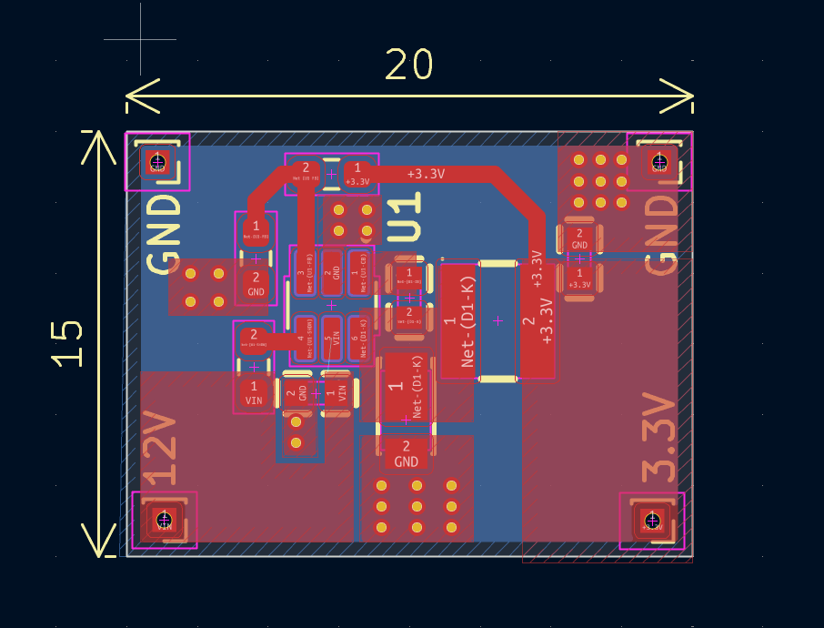

readme_content = """# Ultra-Compact 12V to 3.3V Buck Converter Module (LMR16006)

An ultra-compact, high-efficiency step-down (buck) DC-DC converter breakout board designed using Texas Instruments' **LMR16006XDDCR** synchronous buck regulator. This board steps down a nominal 12V DC input (supports up to 60V) to a regulated 3.3V DC output, making it ideal for powering 3.3V microcontrollers (ESP32, STM32, RP2040) and sensors in space-constrained embedded systems and automotive projects.

---

## 📷 Board Preview

| Top View (3D Render) | Bottom View (3D Render) |
| :---: | :---: |
|  |  |

---

## ✨ Key Features

- **Ultra-Compact Form Factor:** Tiny **20 mm x 15 mm** footprint with standard 2.54 mm (100 mil) header pins for breadboard integration or carrier board mounting.
- **Wide Input Voltage Range:** Supports $4.2\text{V}$ to $60\text{V}$ input range (configured and tested for 12V step-down).
- **High Efficiency & High Frequency:** $700\text{kHz}$ switching frequency allows the use of small surface-mount inductors and capacitors.
- **Optimized High-Current Loop:** Minimal $di/dt$ switching loop area to suppress high-frequency ringing and electromagnetic interference (EMI).
- **Thermal & Grounding Integrity:** Multi-via stitch arrays on high-power thermal pads (Schottky diode anode and IC GND) to ensure efficient heat dissipation into the bottom ground plane.
- **Truncated SW Polygon:** Reduced copper switching node ($SW$) area to prevent parasitic capacitive radiation.

---

## 📐 Circuit Schematic & Calculations

### 1. Output Voltage Selection
The output voltage is configured using a precision feedback resistor divider ($R_2$ and $R_3$) connected to the $FB$ pin ($V_{FB} = 0.765\text{V}$):

$$V_{OUT} = V_{FB} \times \\left(1 + \\frac{R_2}{R_3}\\right)$$

Using standard 1% tolerance resistors:
- $R_2 = 33.2\\text{ k}\\Omega$
- $R_3 = 10.0\\text{ k}\\Omega$

$$V_{OUT} = 0.765\\text{V} \\times \\left(1 + \\frac{33.2\\text{ k}\\Omega}{10.0\\text{ k}\\Omega}\\right) = 0.765\\text{V} \\times 4.32 = \\mathbf{3.305\\text{V}}$$

### 2. Inductor & Switching Selection
- **Inductor ($L_1$):** $6.8\\mu\\text{H}$ power inductor rated for target load current and peak switching ripple.
- **Bootstrap Capacitor ($C_1$):** $100\\text{nF}$ ceramic capacitor driving the internal high-side MOSFET gate driver.
- **Shutdown / Enable ($R_1$):** $100\\text{k}\\Omega$ pull-up resistor tying $SHDN$ to $VIN$ for automatic power-on operation.

---

## 🖼️ PCB Layout & Stackup

### Layout Highlights:
1. **Compact Power Loop:** $C_2$ ($C_{IN}$), $U_1$ ($VIN/SW$), and $D_1$ are placed immediately adjacent to each other to minimize high-frequency AC loop area.
2. **EMI Mitigation:** The SW node copper pour (`Net-(D1-K)`) is tightly constrained to component pads to eliminate unshielded antenna radiation.
3. **Thermal Vias:** A $3\\times 3$ via matrix under the $D_1$ ground pad along with ground stitching around $U_1$ effectively passes heat to the full bottom ground plane layer.
4. **Isolated Feedback Path:** The high-impedance feedback net ($FB$) is routed away from the noisy switching node and inductor body.

---

## 🛒 Bill of Materials (BOM)

| Designator | Quantity | Value / Part Number | Footprint | Description |
| :--- | :---: | :--- | :--- | :--- |
| **U1** | 1 | LMR16006XDDCR | SOT-23-6 (DDC) | 0.6A, 60V, 700kHz Step-Down Regulator |
| **L1** | 1 | 6.8 µH | 4040 / Shielded | Power Inductor |
| **D1** | 1 | Schottky Diode (e.g., B140/SS14) | SMA / SMB | Free-wheeling Catch Diode |
| **C1** | 1 | 100 nF, 50V | 0603 | Bootstrap Capacitor (X7R) |
| **C2** | 1 | 2.2 µF – 10 µF, 50V | 0805 / 1206 | Input Filter Capacitor (X7R) |
| **C3** | 1 | 22 µF, 10V | 0805 | Output Filter Capacitor (X7R) |
| **R1** | 1 | 100 kΩ | 0603 | Shutdown Pull-up Resistor |
| **R2** | 1 | 33.2 kΩ (1%) | 0603 | Feedback Upper Resistor |
| **R3** | 1 | 10.0 kΩ (1%) | 0603 | Feedback Lower Resistor |
| **J1 – J4** | 4 | 1x1 Pin Header | 2.54 mm pitch | Board Power Contacts (12V, GND, 3.3V, GND) |

---

## 🏭 Fabrication Parameters

- **Board Dimensions:** $20\\text{ mm} \\times 15\\text{ mm}$
- **Layer Count:** 2 Layers
- **PCB Thickness:** 1.6 mm
- **Copper Weight:** 1 oz (35 µm)
- **Minimum Trace / Clearance:** 0.25 mm / 0.2 mm
- **Solder Mask Color:** Green (or preferred)
- **Silkscreen:** White

